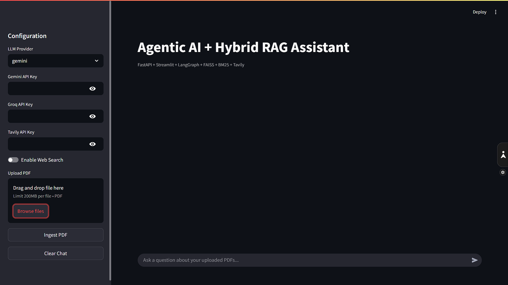

# Agentic AI + Hybrid RAG MVP (Streamlit + FastAPI + LangGraph)

Production-style, beginner-friendly portfolio project that demonstrates:
- Hybrid RAG (FAISS semantic + BM25 lexical)
- Agentic workflow routing with LangGraph
- PDF ingestion and grounded Q&A
- Optional Tavily web search grounding via UI toggle
- Prompt versioning, lightweight evaluation, observability, and local caching

## 1. Architecture

Streamlit UI -> FastAPI -> LangGraph Agent Workflow -> Hybrid Retrieval -> LLM (Gemini/Groq) -> Grounded Response

### Workflow Nodes
1. `router`: sets retrieval mode
2. `rag`: retrieves doc chunks (semantic + lexical fusion + rerank)
3. `web` (optional): Tavily search if enabled
4. `synth`: prompt render + LLM response generation

## 2. Project Structure

```text
.
├── app.py
├── main.py
├── api/
│   ├── dependencies.py
│   └── routes/rag_routes.py
├── agents/
│   ├── llm_client.py
│   └── workflow.py
├── rag/
│   ├── chunker.py
│   ├── hybrid_retriever.py
│   └── ingest.py
├── embeddings/embedder.py
├── vectorstore/
│   ├── faiss_store.py
│   └── bm25_store.py
├── parsers/pdf_parser.py
├── websearch/tavily_client.py
├── memory/conversation_memory.py
├── evaluation/prompt_eval.py
├── cache/file_cache.py
├── prompts/rag_v1.txt
├── utils/
│   ├── config.py
│   ├── logger.py
│   ├── models.py
│   └── prompt_manager.py
├── data/
├── uploaded_files/
├── faiss_index/
├── cache_data/
├── logs/
├── requirements.txt
└── .env.example
```

## 3. Features

- Conversational chat with session memory
- Sliding window + summary memory to reduce token usage
- PDF upload and ingestion with PyMuPDF
- Chunking (`size=800`, `overlap=100`)
- Embedding caching (`all-MiniLM-L6-v2`)
- Persistent FAISS index and BM25 store
- Hybrid fusion + lightweight reranking
- Citations and retrieved context viewer
- Optional web search grounding (`Enable Web Search`)
- Prompt templates and versioning (`prompts/`)
- Local response cache + PDF parse cache + embedding cache
- Structured JSON logs in `logs/app.log`
- Lightweight prompt/retrieval evaluation metrics

## 4. Setup

### Prerequisites
- Python 3.11+ recommended

### Install
```bash
pip install -r requirements.txt
```

### Configure Env
```bash
cp .env.example .env
```

Fill:
- `GEMINI_API_KEY`
- `GROQ_API_KEY`
- `TAVILY_API_KEY`

## 5. Run Locally

### Terminal 1 (FastAPI backend)
```bash
uvicorn main:app --reload --port 8000
```

### Terminal 2 (Streamlit frontend)
```bash
streamlit run app.py
```

Open Streamlit in your browser, enter keys in the sidebar, upload PDFs, then chat.

## 6. UI Guide

Sidebar:
- Gemini API key input
- Groq API key input
- Tavily API key input
- PDF upload + ingest
- `Enable Web Search` toggle
- `Clear Chat`

Main area:
- Multi-turn chat
- Streaming-style response rendering
- Retrieved context panel
- Citations panel
- Metrics panel
- Retrieval mode indicator

## 7. Prompt Management

Prompt templates are in `prompts/`.
Current default: `prompts/rag_v1.txt`.

To version prompts:
1. Add a new file (example `rag_v2.txt`)
2. Update `PromptManager.render(..., version="rag_v2.txt")`

## 8. Observability

Logs written as JSON to `logs/app.log`:
- embedding latency
- retrieval latency
- LLM latency
- retrieval hit counts

## 9. Error Handling

Graceful handling added for:
- non-PDF uploads
- parse/ingestion failures
- missing API keys
- empty retrieval results
- Tavily failures (fallback to doc-only flow)

## 10. Evaluation

`evaluation/prompt_eval.py` returns:
- answer relevance
- context relevance
- hallucination risk (heuristic)
- retrieval quality

## 11. Screenshots

### Main App UI



Add your provided screenshot at:
- `docs/screenshots/main-ui.png`

Optional additional screenshots:
- `docs/screenshots/context-viewer.png`
- `docs/screenshots/hybrid-mode.png`

## 12. Troubleshooting

1. FAISS install issue on Windows:
   - Ensure Python version compatibility and reinstall `faiss-cpu`.
2. Slow first response:
   - First embed/model load is expected; later calls are cached.
3. Empty answers:
   - Ingest at least one valid PDF and verify API keys.
4. Web search not used:
   - Enable toggle and provide Tavily key.


