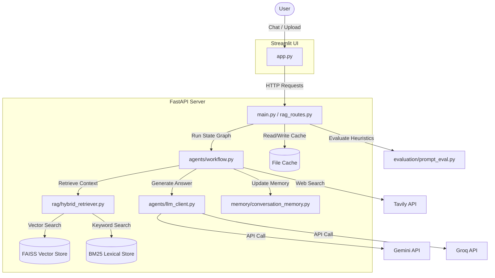

# Agentic AI + Hybrid RAG Assistant

A production-grade, enterprise-ready conversational assistant that combines hybrid retrieval strategies, agentic state-routing, local caching, and robust observability.

## 1. System Architecture

The application is structured into a containerized frontend and backend that communicate via a structured JSON API. The graph routing and agent logic are orchestrated using **LangGraph**.



### Routing & Node Execution Flow
1. **`router` Node**: Inspects settings to toggle web search extension modes.
2. **`rag` Node**: Performs dual-retrieval (FAISS L2 distance + BM25 scores) and executes Reciprocal Rank Fusion (RRF) with token overlap penalties to output high-quality, relevant context.
3. **`web` Node**: Interacts with Tavily Web Search if additional external grounding is requested.
4. **`synth` Node**: Gathers the context blocks, loads prompt versions from `prompts/`, and queries LLM models (Gemini/Groq) for responses.

---

## 2. Project Layout

```text
.
├── Dockerfile                  # Multi-stage optimized Docker build configuration
├── docker-compose.yml          # Container service orchestrations
├── Makefile                    # Developer workflows (install, test, run, clean)
├── LICENSE                     # MIT License
├── README.md                   # System documentation
├── requirements.txt            # Main dependencies
├── app.py                      # Streamlit frontend application
├── main.py                     # FastAPI entry point
├── .env.example                # Environmental template variables
├── .github/                    # CI/CD pipelines
│   └── workflows/ci.yml        # GitHub Actions unit testing pipeline
├── tests/                      # Unit testing suite
│   ├── conftest.py             # isolated configurations and mocks
│   ├── test_api.py             # FastAPI client router tests
│   ├── test_cache.py           # file cache unit tests
│   ├── test_chunker.py         # text chunker tests
│   ├── test_config.py          # configurations checks
│   ├── test_llm.py             # LLM mock client tests
│   ├── test_retriever.py       # hybrid ranking logic assertions
│   └── test_stores.py          # index persistency test scripts
├── api/                        # API router definitions
├── agents/                     # LangGraph workflow and LLM call clients
├── rag/                        # Ingest services and rank fusions
├── embeddings/                 # SentenceTransformers local embeds
├── vectorstore/                # FAISS vector store and BM25 store definitions
├── parsers/                    # PyMuPDF PDF extractors
├── websearch/                  # Web search clients
├── memory/                     # Conversation context and summarizers
├── evaluation/                 # Retrieval metrics and risk calculations
├── cache/                      # File cache handlers
└── prompts/                    # Versioned system prompt templates
```

---

## 3. Local Setup & Installation

### Prerequisites
* Python 3.11+
* Docker & Docker Compose (optional for container deployments)

### 1. Install Dependencies
Initialize your virtual environment and install standard and developer testing packages:
```bash
make install
```
*Alternatively, install via pip:*
```bash
pip install -r requirements.txt
pip install pytest pytest-cov pytest-mock httpx
```

### 2. Configure Environment Variables
Copy the template variables file:
```bash
cp .env.example .env
```
Fill out the required API keys and provider variables:
* `GEMINI_API_KEY`: Key from Google AI Studio.
* `GROQ_API_KEY`: Key from Groq Console.
* `TAVILY_API_KEY`: Key from Tavily for optional web grounding.

---

## 4. Developer Workflows

This project includes a `Makefile` to quickly trigger developer operations.

* **Run Backend (FastAPI)**:
  ```bash
  make run-backend
  ```
  Starts the API server at `http://localhost:8000`. API docs will be active at `/docs`.

* **Run Frontend (Streamlit)**:
  ```bash
  make run-frontend
  ```
  Starts the UI server at `http://localhost:8501`.

* **Run Tests & Code Coverage**:
  ```bash
  make test
  ```
  Executes the isolated unit testing suite and outputs a coverage report.

* **Clean Workspace**:
  ```bash
  make clean
  ```
  Wipes logs, vector files, database cache entries, and temporary pycache files.

---

## 5. Deployment Options

### Option A: Docker Compose (Multi-Container Deployment)
To launch the entire application stack locally in isolated network containers:
1. Start the containers in detached mode:
   ```bash
   make docker-up
   ```
2. The Streamlit UI will be accessible at `http://localhost:8501` and FastAPI backend at `http://localhost:8000`.
3. To bring down the services:
   ```bash
   make docker-down
   ```

### Option B: Cloud Container Deployment (AWS ECS, GCP Cloud Run, Azure Container Apps)
Since the application uses a standard Dockerfile, it can be deployed directly to cloud container platforms:
1. **Build and Tag the Image**:
   ```bash
   docker build -t <registry>/rag-chat-agent:latest .
   ```
2. **Push to Registry**: Push to AWS ECR, GCP Artifact Registry, or DockerHub.
3. **Deploy Backend**: Run the backend service exposing port `8000` with the startup command `uvicorn main:app --host 0.0.0.0 --port 8000`. Provide environment variables via a cloud secret manager.
4. **Deploy Frontend**: Run the frontend service exposing port `8501` with the command `streamlit run app.py --server.port 8501 --server.address 0.0.0.0`. Set the environment variable `API_BASE` to the public/private URL of your FastAPI backend service.

### Option C: Streamlit Community Cloud
If you want to host only the Streamlit UI on the free Streamlit Community Cloud:
1. Push the code to a public GitHub repository.
2. Link the repository to Streamlit Community Cloud.
3. Configure the secret `API_BASE` in the Streamlit Cloud dashboard pointing to your self-hosted FastAPI backend (e.g. deployed on Render, Fly.io, or AWS EC2).

---

## 6. Observability & Logging

* **Console Logging**: Application logs are formatted into readable human-friendly text strings on standard output (`sys.stdout`) for instant container observation.
* **Rotating File Logging**: Detailed JSON structured logs are written to `logs/app.log`. The files automatically rotate at `10MB` sizes, preserving up to `5` historical files.
* **Telemetry Details**: Logs record model request latencies, embedding generation times, hybrid retrieval hit counts, and evaluation relevance scores.
